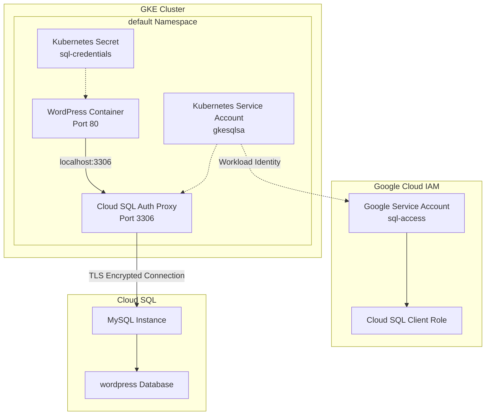
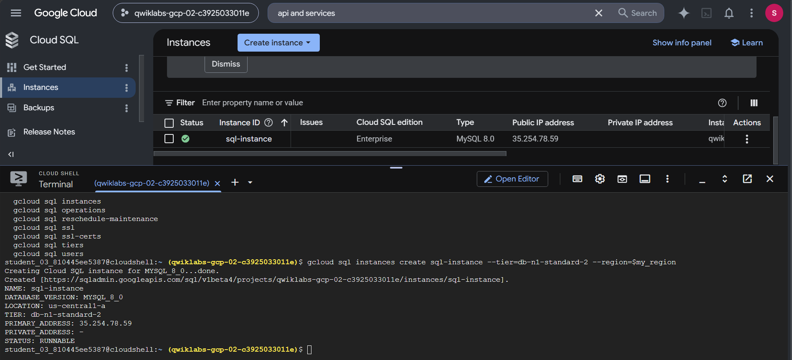
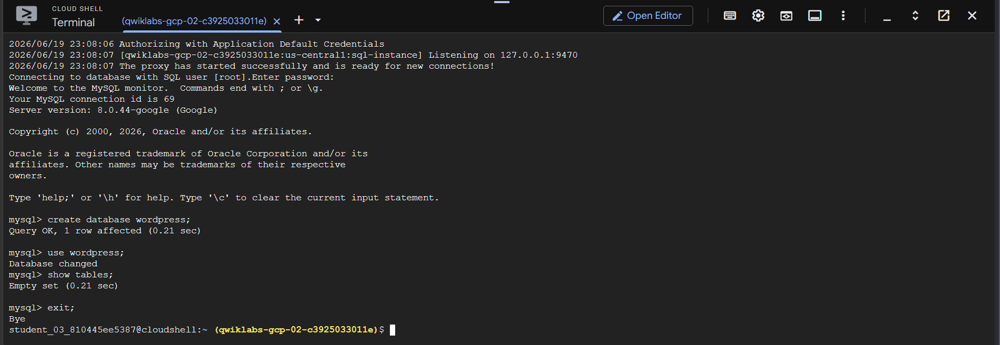
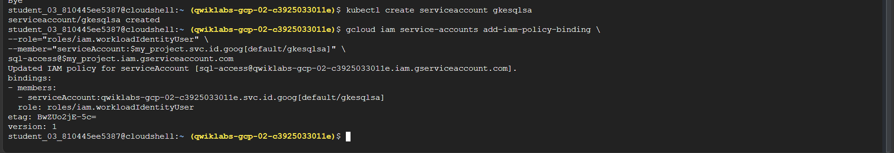
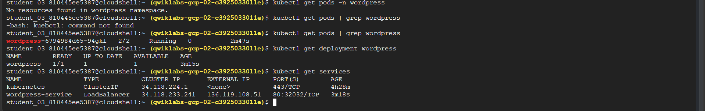
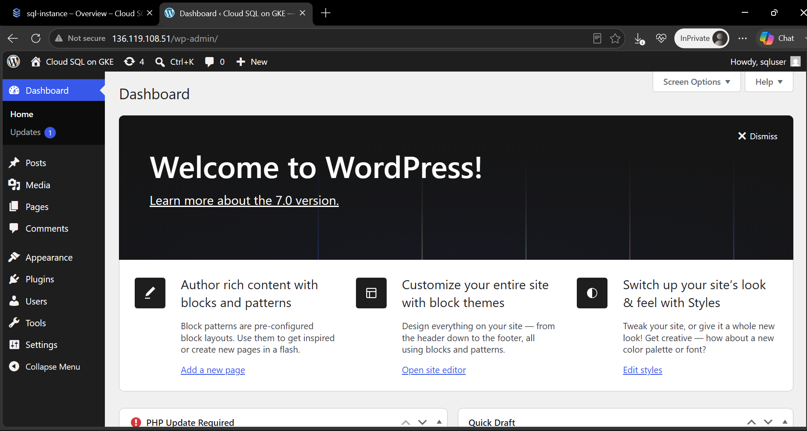
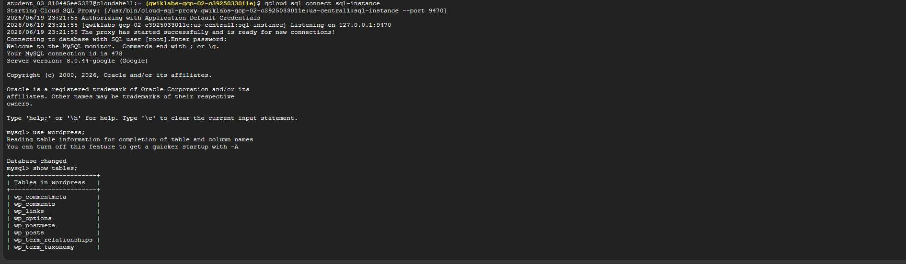
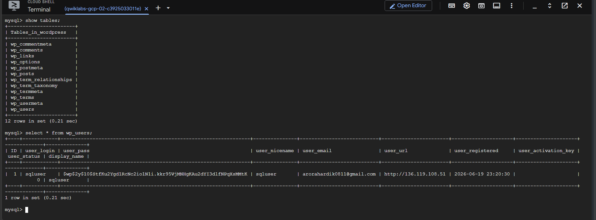

# Connecting WordPress on GKE to Cloud SQL via Workload Identity and SQL Auth Proxy

This repository documents the implementation of a highly secure, production-grade deployment of WordPress on Google Kubernetes Engine (GKE) Autopilot, integrated with a managed Google Cloud SQL (MySQL) database.

Rather than exposing database credentials or using static, long-lived service account JSON keys (which present a significant security vulnerability), this architecture leverages **GKE Workload Identity** for authorization and the **Cloud SQL Auth Proxy** sidecar container for secure, encrypted connectivity.

---

## 🏗️ Architecture Overview

The following diagram illustrates the architecture of this deployment, showing how the application container (`web`) securely communicates with Cloud SQL through the local `cloudsql-proxy` sidecar, authenticated using GKE Workload Identity.


---

## 🔑 Core Concepts Explained

### 1. The Sidecar Container Pattern
In Kubernetes, a Pod is a group of one or more containers that share network namespaces, storage, and loopback network interfaces. 
* **The Problem:** The WordPress application expects a direct connection to a MySQL database. However, Cloud SQL is external and requires secure authentication/TLS encryption.
* **The Solution (Sidecar):** We deploy the `cloudsql-proxy` as a second container within the same WordPress Pod. WordPress is configured to talk to `127.0.0.1:3306` (localhost). The proxy listens on that local port, intercepts the traffic, establishes a secure SSL/TLS tunnel, and forwards it to the external Cloud SQL instance. This removes the need for WordPress to manage database certificates or SSL configuration.

### 2. GKE Workload Identity
Workload Identity is the recommended way for applications running on GKE to access Google Cloud services.
* **The Old Way:** Downloading a Service Account JSON key and storing it as a Kubernetes Secret. If this key is leaked, attackers gain permanent access.
* **The Workload Identity Way:** We bind a Kubernetes Service Account (KSA) directly to a Google Service Account (GSA). GKE dynamically generates short-lived OAuth 2.0 credentials for the pod. The SQL Auth Proxy automatically retrieves these credentials from the GKE metadata server to authenticate with the Cloud SQL instance. No credentials or keys are stored in the code or cluster!

---

## 🚀 Step-by-Step Implementation

### Task 1: Connect to the GKE Cluster
First, we set up our environment variables and configure cluster credentials for `kubectl`.

```bash
# Define environment variables
export my_cluster=autopilot-cluster-1
export my_project=$(gcloud config get-value project)
export my_region=us-central1

# Configure tab completion for kubectl
source <(kubectl completion bash)

# Fetch credentials for the GKE cluster
gcloud container clusters get-credentials $my_cluster --region $my_region
```

---

### Task 2: Enable Cloud SQL APIs
To provision and manage Cloud SQL instances, we must enable the `sqlservice` and `sqladmin` APIs.

```bash
# Enable the Cloud SQL Admin API
gcloud services enable sqladmin.googleapis.com
```

---

### Task 3: Create the Cloud SQL Instance & Database
We provision a MySQL instance with the standard machine tier and configure a database user.

```bash
# Create Cloud SQL Instance (MySQL 5.7 by default)
gcloud sql instances create sql-instance --tier=db-n1-standard-2 --region=$my_region
```


*Cloud SQL Instance `sql-instance` successfully provisioned in `us-central1`.*

Once the instance is active:
1. Navigate to **SQL** > **sql-instance** > **Users** in the GCP Console.
2. Create a user account:
   * **Username:** `sqluser`
   * **Password:** `sqlpassword`
   * **Host:** Allow any host (`%`)
3. Copy the **Instance Connection Name** from the instance overview page.

Next, set up the database:
```bash
# Store the connection name as an environment variable
export SQL_NAME="qwiklabs-gcp-d03ee58ad9ad507e:us-central1:sql-instance" # Example

# Connect to your instance via the MySQL client
gcloud sql connect sql-instance
```

Inside the MySQL prompt, create the WordPress database:
```sql
-- Create database
CREATE DATABASE wordpress;

-- Verify database creation
USE wordpress;
SHOW TABLES; -- Empty set (no tables yet)
EXIT;
```


*Connected to the MySQL instance and created the database `wordpress`.*

---

### Task 4: Create GCP IAM Service Account
We create a Google Service Account (GSA) and grant it the `Cloud SQL Client` role, which allows it to connect to the SQL instance.

1. Navigate to **IAM & Admin** > **Service Accounts**.
2. Click **Create Service Account**.
3. Name: `sql-access`.
4. Add Role: **Cloud SQL Client** (`roles/cloudsql.client`).

---

### Task 5: Configure GKE Workload Identity
This is the key step to bind the Kubernetes Service Account (KSA) inside GKE with the Google Service Account (GSA) in IAM.

```bash
# 1. Create a Kubernetes Service Account (KSA)
kubectl create serviceaccount gkesqlsa

# 2. Add the IAM policy binding to trust the KSA to act as the GSA
gcloud iam service-accounts add-iam-policy-binding \
  --role="roles/iam.workloadIdentityUser" \
  --member="serviceAccount:$my_project.svc.id.goog[default/gkesqlsa]" \
  sql-access@$my_project.iam.gserviceaccount.com

# 3. Annotate the KSA to link it directly to the GSA
kubectl annotate serviceaccount \
  gkesqlsa \
  iam.gke.io/gcp-service-account=sql-access@$my_project.iam.gserviceaccount.com
```


*Kubernetes Service Account configured and annotated with GSA details.*

---

### Task 6: Create Kubernetes Database Secrets
We store the MySQL username and password inside a Kubernetes Secret so they can be securely injected into our WordPress web container.

```bash
# Create the generic Kubernetes Secret
kubectl create secret generic sql-credentials \
   --from-literal=username=sqluser \
   --from-literal=password=sqlpassword
```

---

### Task 7: Deploy WordPress and SQL Proxy Sidecar
We write our manifest `sql-proxy.yaml` containing the Deployment (comprising the `web` container, `cloudsql-proxy` container, and `gkesqlsa` Service Account) and the `LoadBalancer` Service.

Apply the manifest using:
```bash
# Substitute the placeholder with our SQL instance connection name
sed -i 's/<INSTANCE_CONNECTION_NAME>/'"${SQL_NAME}"'/g' sql-proxy.yaml

# Apply the manifest to GKE
kubectl apply -f sql-proxy.yaml

# Monitor deployment progress
kubectl get deployment wordpress
kubectl get services
```


*Pod is ready with 2/2 containers running (WordPress + SQL Proxy), and the LoadBalancer IP is provisioned.*

---

### Task 8: Complete WordPress Wizard & Database Verification
Access the application by navigating to the LoadBalancer's **External IP** (`http://<EXTERNAL-IP>`) in your web browser. 

1. Fill out the WordPress installation wizard (Site Title, Admin Username, Password, Email).
2. Click **Install WordPress**.


*WordPress successfully installed and wizard finished.*

During the installation wizard, WordPress automatically connects to the database via `localhost:3306` (Cloud SQL Proxy) and provisions its database tables. 

To verify, connect back to your Cloud SQL instance via MySQL:
```bash
gcloud sql connect sql-instance
```

Query the database:
```sql
USE wordpress;
SHOW TABLES;
```


*WordPress tables (e.g., `wp_posts`, `wp_users`, `wp_options`) successfully populated by WordPress.*

Finally, read the administrative user entry:
```sql
SELECT * FROM wp_users;
```


*The WordPress admin account created in the setup wizard is successfully stored in the database.*

---

## 🛠️ Configuration Files Reference

* [sql-proxy.yaml](sql-proxy.yaml): The Kubernetes manifest containing the Deployment and LoadBalancer Service.
* [.gitignore](.gitignore): Git ignore rules for clean repository state.

---

## 🏆 Key Takeaways & Best Practices
1. **Never use static JSON keys in production:** Static service account keys represent a significant security risk. Workload Identity is the Google Cloud standard for authorization on GKE.
2. **Sidecar proxy isolation:** Running the proxy inside the Pod ensures database connection requests are sent over a secure localhost socket within the network namespace, ensuring isolation from other pods.
3. **Structured Logging:** Enforcing `--structured-logs` on the SQL proxy container ensures that proxy status, connection handshakes, and errors are logged as standard JSON for Cloud Logging/Kibana parsing.
